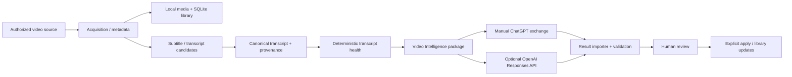

# VideoHoarder

[](https://github.com/gbansal86/VideoHoarder/actions/workflows/ci.yml)
[](https://github.com/gbansal86/VideoHoarder/actions/workflows/codeql.yml)
[](https://github.com/gbansal86/VideoHoarder/actions/workflows/windows-build.yml)
[](LICENSE)


**VideoHoarder** is a local-first, open-source Windows application for building a durable video intelligence library from videos a user is authorized to access. It combines download/library management, metadata, canonical transcripts, transcript-health analysis, searchable reports, and optional AI-assisted semantic processing.

The project is designed around a simple rule: **source evidence stays deterministic and reviewable; AI suggestions never silently change the library.**

## What it does

- Downloads and organizes supported video sources through managed jobs.
- Maintains a persistent SQLite library with recovery/migration support.
- **Imports arbitrary local video files/folders** without YouTube IDs using safe reference/copy/confirmed-move modes (v33.2).
- Acquires, normalizes, and evaluates transcript/subtitle evidence.
- Preserves canonical timestamped transcript segments and provenance.
- Produces local HTML/search/report outputs.
- Builds self-contained Video Intelligence packages for semantic processing.
- Supports the existing **manual ChatGPT exchange** workflow.
- Supports an **optional OpenAI Responses API** workflow for transcript intelligence.
- Uses one VIDEO_ID per API/model call to prevent cross-video evidence leakage.
- Imports API output through the same deterministic validation and review pipeline as manual results.
- Keeps rename/move/delete/apply operations behind explicit review actions.
- Includes a native PySide6 desktop command centre and embedded specialist views.

## Architecture



AI processing is an optional downstream layer. Acquisition, transcript normalization, package generation, validation, and the core local library continue to work without an OpenAI API key.


## Quick start with annotated guides


For a complete beginner walkthrough, see [docs/QUICK_START.md](docs/QUICK_START.md). The guide covers installation, launching the app, importing local hard-drive videos, transcript intelligence, privacy defaults, and what must never be committed to a public repository.


## Windows CI build

VideoHoarder now builds a frozen Windows executable from a clean public checkout in GitHub Actions. The workflow runs the privacy audit, full tests, PyInstaller build, and a clean-room frozen-app self-test **before** it uploads anything.

For a layman-friendly download:

1. Open **Actions → Windows Build Artifact**.
2. Open the latest successful run on `main`.
3. Scroll to **Artifacts** and download **VideoHoarder-Windows-CI**.
4. GitHub wraps the uploaded file in an artifact ZIP. Open it to find the versioned VideoHoarder Windows ZIP.
5. Inside the versioned ZIP, `BUILD_INFO.txt` records the commit and EXE SHA-256; `release_self_test.json` records the frozen-app acceptance result.

Actions artifacts are temporary CI evidence (currently retained for 30 days), not a code-signed long-term GitHub Release. A formal release should still follow [RELEASING.md](RELEASING.md).

## Import videos from your hard drives

Choose **Import Local Videos** in the desktop sidebar (or open `/import-local` in the local dashboard). Paste one or more file/folder paths, run a read-only preview, and import in **leave-in-place** mode by default. Local videos use stable `local_...` IDs; adjacent subtitles/transcripts can be associated without any network request. For setup, sidecar rules, and limitations, see [docs/LOCAL_VIDEO_IMPORT.md](docs/LOCAL_VIDEO_IMPORT.md).

## OpenAI API option

VideoHoarder v33.1+ includes an optional API provider beside the existing manual package workflow.

### Privacy and safety defaults

- The API is **disabled by default**.
- The API key value is **never saved in VideoHoarder config**. Only an environment-variable name is stored; the default is `OPENAI_API_KEY`.
- API calls use `store=false` by default.
- Each model request contains exactly one video's permitted package evidence.
- Normal transcript-intelligence packages exclude descriptions, viewer comments, raw format lists, cookies, tokens, and machine-local paths.
- Private/unlisted/restricted videos are **not sent by default**. Sending them requires an explicit opt-in and appropriate authorization.
- API results are imported into VideoHoarder's existing validator and remain **NOT_APPLIED** until reviewed.
- If Structured Outputs cannot accept a historical package schema, VideoHoarder can fall back to JSON-object output while retaining its own deterministic importer as the final validation authority.

### Configure it

Install dependencies, then set the key in the process/user environment rather than in a project file.

PowerShell for the current terminal:

```powershell
$env:OPENAI_API_KEY = "your-key-here"
```

Then open **Settings → Knowledge & AI**, enable **OpenAI API transcript intelligence**, select the model/reasoning effort, and use **ChatGPT Processing → Optional OpenAI API transcript processing**.

See [docs/OPENAI_API_INTEGRATION.md](docs/OPENAI_API_INTEGRATION.md) for the exact data flow, configuration, audit files, and failure/retry behavior.

## Manual processing remains supported

The existing file-first flow is still available:

1. Select videos/features.
2. Create a local `CHATGPT_PACKAGE.json`.
3. Process it manually with the supported external AI workflow.
4. Import the returned JSON.
5. Let VideoHoarder validate provenance, IDs, timestamps, requested features, and package integrity.
6. Review before applying any proposed changes.

The API option does not remove or weaken this path.

## Source layout

```text
app/                       Core application and focused service modules
app/prompts/               Versioned semantic prompt assets
build_support/             Desktop launcher, icons, Windows version metadata
PROJECT_KNOWLEDGE/         Maintainer architecture and operational knowledge
specs/                     Current contracts and implementation evidence
tests/                     Regression, architecture, GUI and validation tests
docs/                      Public implementation/security/API documentation
run_gui.pyw                Native desktop entry point
BUILD_WINDOWS.ps1          One-file Windows build and validation
VideoHoarder.spec          PyInstaller full desktop build
```

`app/app.py` remains a large legacy/orchestration module. New functionality should be added to focused modules and called through thin compatibility/orchestration functions; see [ROADMAP.md](ROADMAP.md).

## Run from source

Recommended development environment: Windows with Python 3.12.

```powershell
python -m venv .venv
.\.venv\Scripts\Activate.ps1
python -m pip install --upgrade pip
python -m pip install -r requirements-build.txt
python run_gui.pyw
```

See [DESKTOP_README.md](DESKTOP_README.md) for Windows installer/build details.

## Tests

Compile the project and run the full suite:

```powershell
python -m compileall -q app tests build_support
python -m pytest -q
```

The OpenAI provider tests use a fake SDK/client and make **no external API calls**.

## Build Windows release

```powershell
.\BUILD_WINDOWS.ps1
```

The build runs source validation/tests before producing the packaged application. Release archives are intentionally not committed.

## Contributing

Bug reports, regression tests, documentation fixes, focused refactors, provider hardening, portability work, and carefully scoped features are welcome. Read [CONTRIBUTING.md](CONTRIBUTING.md), [SECURITY.md](SECURITY.md), and [GOVERNANCE.md](GOVERNANCE.md) first.

## Responsible use

VideoHoarder is intended for local library management and analysis of content the user is authorized to access. Users are responsible for complying with source-platform terms, copyright law, privacy obligations, and API/provider terms.

## License

MIT. See [LICENSE](LICENSE).

## Public-source privacy and future API setup

This repository is publishable **without an API key**: the optional OpenAI provider is disabled by default. Each user may configure their own API key locally later; no maintainer-owned key or paid account is bundled. See [Public release checklist](docs/PUBLIC_RELEASE_CHECKLIST.md) before pushing to GitHub. Do not publish `exchange/`, live configurations, databases, downloads, or local transcript/package results. Existing public Git history must be reviewed separately.
