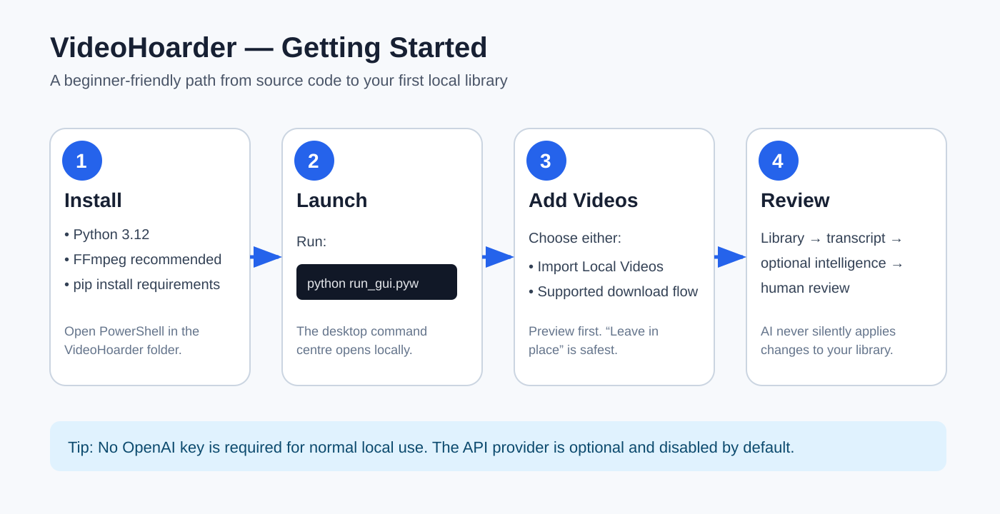
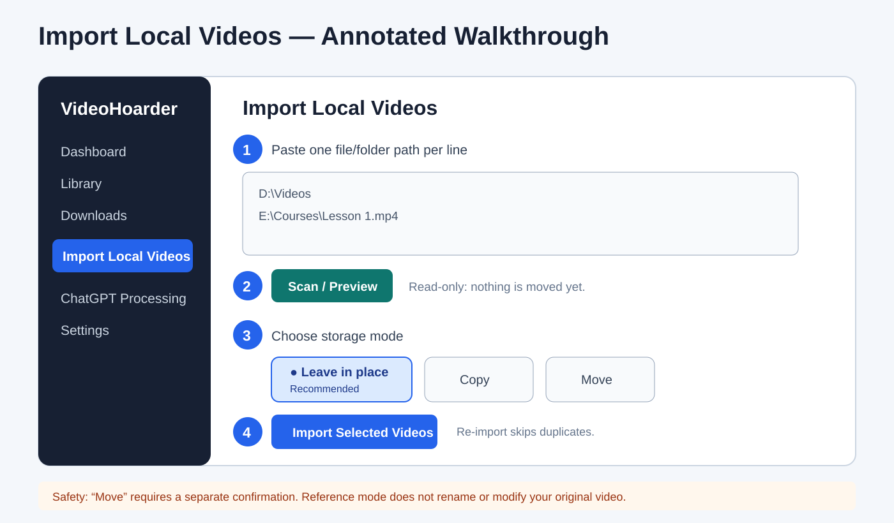
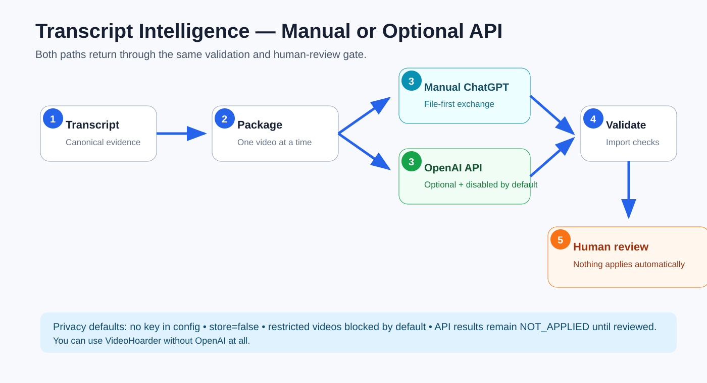
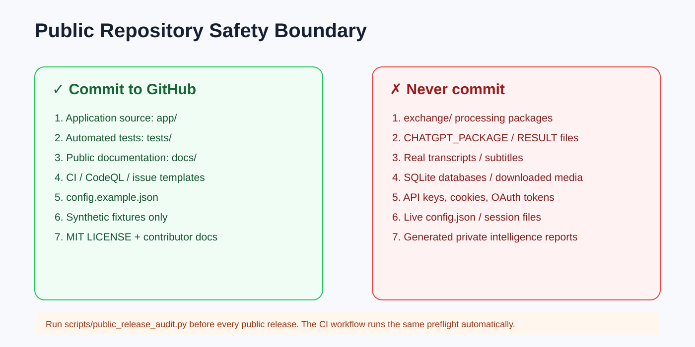

# VideoHoarder Quick Start — Beginner Guide

This guide is written for someone who is comfortable opening folders and PowerShell but does not need to understand the source code. VideoHoarder is local-first: normal library use does **not** require an OpenAI API key.

## Step 1 — Download or clone the repository

Use the green **Code** button on GitHub and choose **Download ZIP**, or clone the repository with Git. Extract it to a normal writable folder such as `C:\VideoHoarder`. Avoid running directly from inside a ZIP archive.



## Step 2 — Install Python and dependencies

Install Python 3.12 on Windows. FFmpeg/FFprobe is strongly recommended for media inspection and the download workflow. Open PowerShell inside the VideoHoarder folder and run:

```powershell
python -m venv .venv
.\.venv\Scripts\Activate.ps1
python -m pip install --upgrade pip
python -m pip install -r requirements-build.txt
```

## Step 3 — Launch VideoHoarder

```powershell
python run_gui.pyw
```

The native desktop command centre opens locally. The application keeps its runtime database, logs, downloads, and processing data outside the public-source files.

## Step 4 — Import videos already on your hard drive

Open **Import Local Videos** in the left sidebar.



1. Paste an absolute file or folder path, one per line.
2. Click **Scan / Preview**. This is read-only.
3. Choose a mode. **Leave in place** is the safest default. **Copy** creates a managed copy. **Move** relocates the original and requires an extra confirmation.
4. Click **Import Selected Videos**. Re-importing the same source path is skipped instead of creating a duplicate record.
5. Open **Library** to find and play the imported item.

If an adjacent `.srt`, `.vtt`, `.transcript.txt`, `.transcript_timestamped.txt`, or `.timestamped.txt` sidecar exists, VideoHoarder can associate it with the local video. Automatic speech-to-text for a video with no transcript is not included yet.

See [LOCAL_VIDEO_IMPORT.md](LOCAL_VIDEO_IMPORT.md) for supported extensions and detailed behavior.

## Step 5 — Use transcript intelligence when you want it

VideoHoarder keeps transcript processing separate from acquisition. You have two optional downstream paths:



1. **Manual ChatGPT exchange** — create a package, process it manually, then import the returned JSON.
2. **Optional OpenAI API** — disabled by default. A user can later provide their own `OPENAI_API_KEY` in the environment and enable the provider in **Settings → Knowledge & AI**.

Both paths return through VideoHoarder's deterministic importer and **human review**. Suggested changes are not silently applied.

## Step 6 — Keep private data out of GitHub

If you modify VideoHoarder or publish a fork, keep the following boundary in mind:



Before a public release, run:

```powershell
python scripts/public_release_audit.py .
```

The GitHub CI workflow runs the same public-source privacy preflight. Never commit API keys, cookies, databases, downloaded videos, real transcripts, `exchange/` packages, or generated intelligence results.

## Step 7 — Run the tests

```powershell
python -m compileall -q app tests build_support
python -m pytest -q
```

The provider tests use fake clients and make no paid OpenAI API request.

## Step 8 — Build a Windows release

For maintainers:

```powershell
.\BUILD_WINDOWS.ps1
```

A Windows binary should be tested on a real Windows machine before publishing it as a release asset.

## Need help?

Read [SUPPORT.md](../SUPPORT.md), search existing GitHub issues, then open a bug report with reproducible steps if needed. Do **not** paste secrets, cookies, private transcripts, or personal media into an issue.
